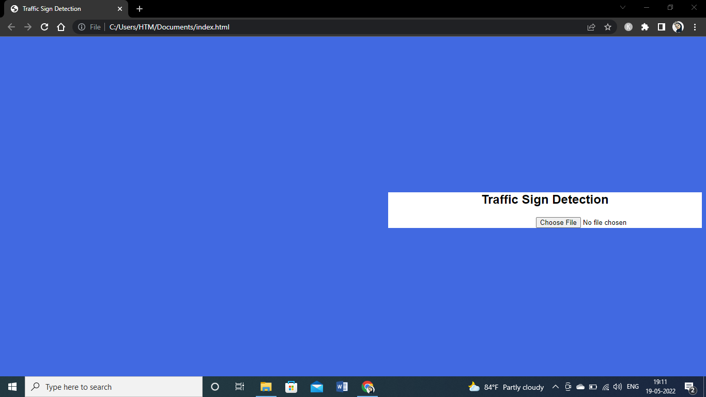

# Traffic-Sign-Detection
In this Project we consider the input image and result the output as the meaning of the sign if it is not a sign image we produce an not the sign image as the output. We use the Microsoft Custom Vision to train our model in this project

<h2>Demonstration</h2>

